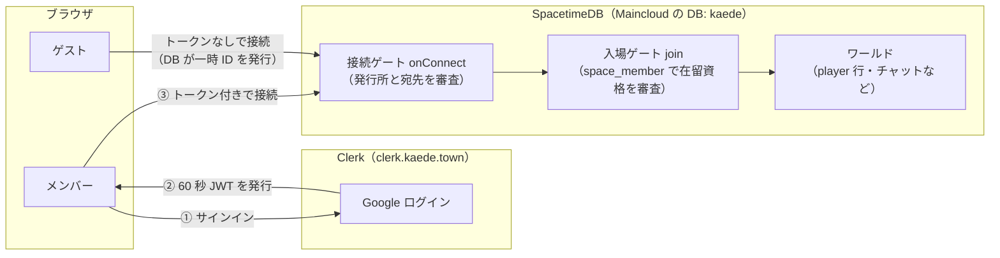
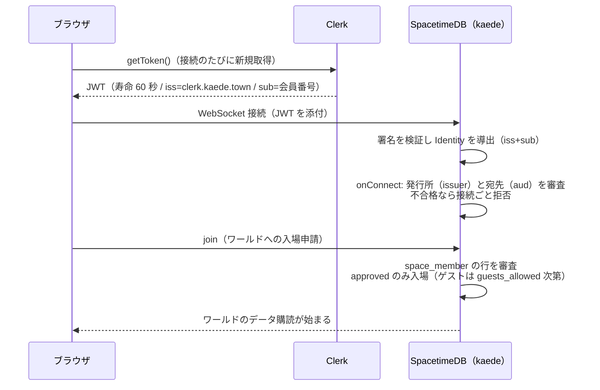
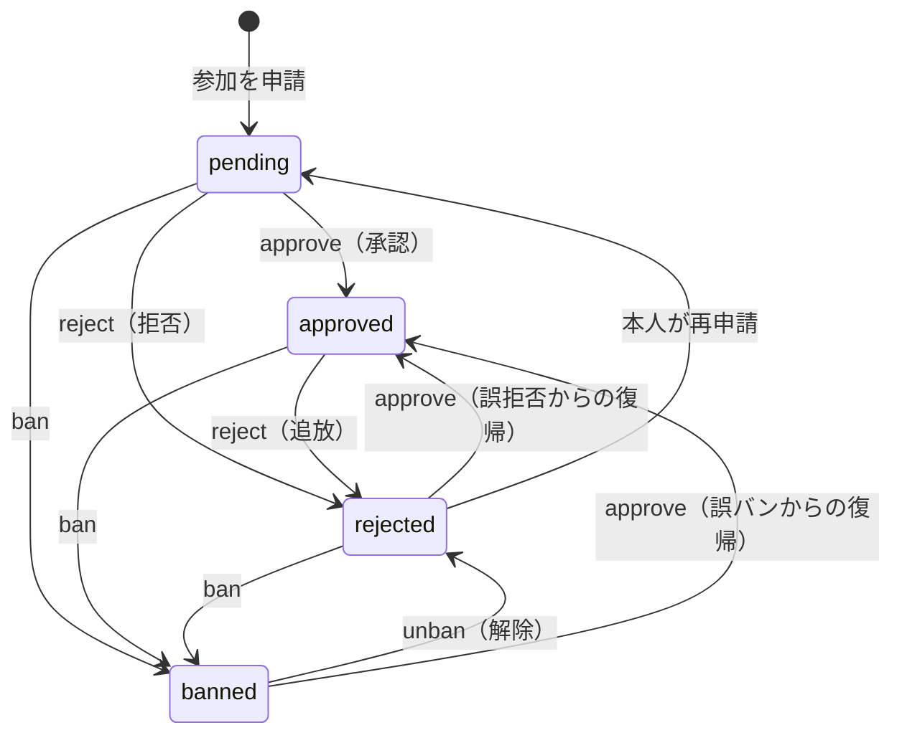
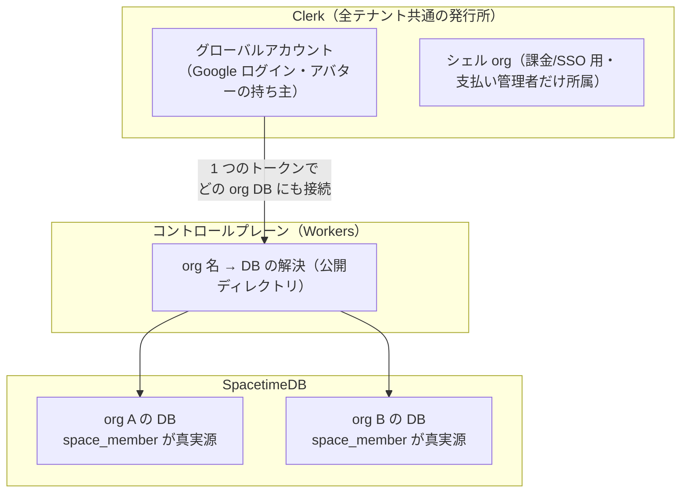

# kaede の認証アーキテクチャ（やさしい解説）

人に説明するための文書。正確な決定記録と理由は
[ADR](./adr-auth-clerk-and-tenant-design.md)、実装は `packages/server/src/reducers.ts`
（接続ゲート）と `packages/shared/src/membership.ts`（判定規則）にある。
最終更新 2026-08-04。

## 3 行まとめ

1. **Clerk は「パスポート発行所」、kaede の DB は「入国審査と在留資格」。**
   誰であるか（認証）は Clerk のトークンで証明し、何ができるか（認可）は
   すべて kaede の DB 内のテーブルで決める。
2. **パスポート番号（Identity）は「発行所 + 会員番号」から機械的に決まる**ので、
   DB が消えても同じ人は同じ番号に戻る。発行所の住所（issuer）は自分のドメイン
   `clerk.kaede.town` に置いてあり、最悪 Clerk と決別しても番号を保てる。
3. **Ban は二層**: 「このスペースからの追放」は kaede が持ち（Discord のサーバー
   BAN 相当）、「サービス全体からの追放」は Clerk が持つ（Discord 社による
   アカウント停止相当）。

## 全体像

ポイントは**ゲートが 2 つある**こと。「接続できる」（トークンが本物で、うちの
アプリ宛て）と「世界に入れる」（承認済みメンバー、またはゲスト許可中のゲスト）は
別の審査で、どちらもサーバー側でしか判定しない。

## しくみ 1: Identity — パスポート番号はどう決まるか

SpacetimeDB はユーザーの識別子（Identity）を、トークンの **iss（発行所の URL）+
sub（発行所内での会員番号）から決定的に導出**する。つまり:

- 同じ人が何度ログインし直しても、別のデバイスからでも、**同じ Identity** になる
- DB を作り直しても、同じ Clerk でサインインし直せば**全員が同じ Identity に戻る**
  （バックアップ・復旧手順がこの性質に立脚している — [docs/backup-restore.md](./backup-restore.md)）
- 裏返すと、**発行所（issuer）を変えると全員の Identity が変わる**。これがこの
  アーキテクチャで唯一の不可逆ポイント

だから発行所の住所を自分の土地に置いた。issuer は `https://clerk.kaede.town` —
Clerk のサービスだが **URL は kaede のドメイン**なので、Clerk と決別する日が
来ても、同じ URL で後継の発行所を立てて会員番号（sub）を引き継げば Identity は
全員無傷で残る（手順は [ADR §4.3](./adr-auth-clerk-and-tenant-design.md)）。

## しくみ 2: メンバーの接続から入場まで

補足:

- トークンは**接続のたびに取り直す**（60 秒しか生きないキャッシュ禁止設計）。
  盗まれても 1 分で失効する
- 発行所の審査は**データベース単位**で分岐する: 本番 DB では本番 issuer だけが
  メンバーになれる（開発用 Clerk のトークンは本番では拒否 — ROADMAP の
  「issuer ゲート①」）
- Clerk のセッション情報を信じて入場させることは**しない**。SpacetimeDB の
  モジュールは外部 API を呼べないので、判定材料はトークンのクレームと自分の
  テーブルだけ — これが「認可は DB 側」という分担の技術的な理由でもある

## しくみ 3: ゲスト

ゲストはログインしない。トークンなしで接続すると DB が**一時パスポート**
（サーバー発行トークン）をくれて、それがタブ限りの Identity になる
（`sessionStorage` 保持 — リロードでは同じキャラ、新しいタブでは別人）。

- ゲストが入場できるかは `space_setting` の `guests_allowed` トグル 1 つで決まる
- 不許可に切り替えると**接続中のゲストは同一トランザクションで即キック**される。
  「今この場にゲストがいてほしくない」への即応レバー

## しくみ 4: メンバーシップ（待合室と状態機械）

スペースへの参加は申請制。状態は 4 つで、**管理操作は状態遷移だけ・行は決して
消さない**（誤操作を常に取り消せる）。

- `rejected` は「本人が明示的に再申請すれば列に戻れる」。`banned` は
  **再申請そのものを封じる** — 2 つの違いはここだけ
- 初代管理者は「空のデータベースで最初に申請した人」に自動で付く（環境ごとの
  シード定数が不要になる設計。将来の組織作成フローでは「作成者 = 初期管理者」に
  置き換える）
- 管理者は操作対象にできない（管理者ゼロ事故の防止）

## しくみ 5: Ban の二層

| | org 層（スペース BAN） | プラットフォーム層（サービス BAN） |
| --- | --- | --- |
| 意味 | このスペースから永久追放（再申請も封じる） | kaede というサービス全体から追放 |
| Discord でいうと | サーバー BAN | Discord 社によるアカウント停止 |
| 持ち主 | kaede の DB（`space_member` の `banned`） | Clerk の user ban（Backend API） |
| 操作できる人 | そのスペースの管理者 | 運営（私たち）だけ |
| 実装 | 実装済み | 実装不要（Clerk の機能をそのまま使う） |

こう分けるのは Discord 型アカウントモデルのガードレール —
**「あるスペースの処分がグローバルアカウントを壊してはいけない」** — のため。
スペース A で BAN されても、その人のアカウント・アバター・スペース B での
メンバーシップは無傷でなければならない。だから org 層の BAN を Clerk（=
グローバルなアカウント基盤）に置くことは原理的にできない。

なお**ゲストに BAN は実質効かない**（タブを開き直せば別人になるため）。ゲストの
問題行動への正しいレバーは個人 BAN ではなく `guests_allowed` トグル（即キック）。

## 将来: マルチテナント（SaaS 期）の形

いまは 1 スペース＝1 DB だが、SaaS 期は**テナントごとに DB を分ける**
（1 org = 1 DB）。そのときも上の構図は変わらない — 各 org DB が自分の
`space_member` を持ち、自分の入国審査を行う。

- **メンバーシップの真実源は各 org DB**。Clerk の Organizations 機能はテナントの
  台帳には使わない（課金・エンタープライズ SSO が必要になったときに「シェル」
  として最小限で使う）
- スペースへの**招待はリンク招待**（Discord 式 — URL の招待コードを
  リデューサーが検証）。メール基盤は持たないまま
- トークンは org 情報を持たない素のままなので、複数のタブで別々の org を開いても
  取り違えが起きない

## 想定問答（説明用）

- **Q. Clerk にログインしたのに「参加を申請する」が出るのはなぜ?**
  A. ログイン（認証）とスペースの一員であること（認可）は別だから。パスポートを
  持っていることと、その国に住めることが別なのと同じ。
- **Q. なぜ入場判定を Clerk 側でやらないの?**
  A. ①SpacetimeDB のモジュールは外部 API を呼べない ②リアルタイムの世界の権威は
  サーバー（DB）に一元化する方針 ③スペースごとの資格は org スコープの情報で、
  グローバルなアカウント基盤に置くべきでない、の 3 つ。
- **Q. Clerk が値上げ・サービス終了したら?**
  A. issuer が自分のドメインなので、ユーザーを全量エクスポートして後継の発行所に
  差し替えれば Identity は全員無傷（ADR の脱出手順）。
- **Q. DB が全損したら誰が誰だか分からなくなる?**
  A. ならない。Identity は「発行所 + 会員番号」から再計算できるので、全員が
  ログインし直せば同じ Identity に戻る。日次バックアップの `space_member` を
  照合表にして資格を再宣言する（backup-restore.md）。
